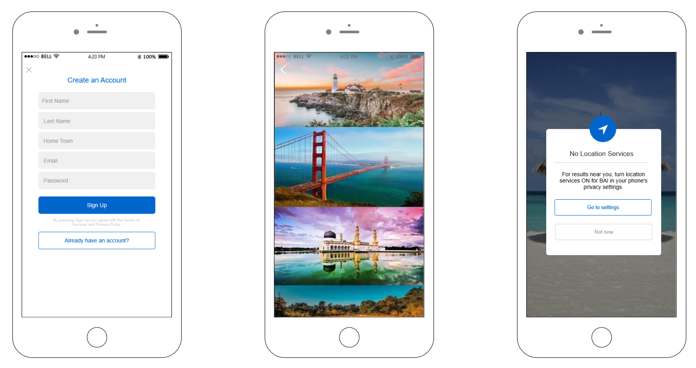
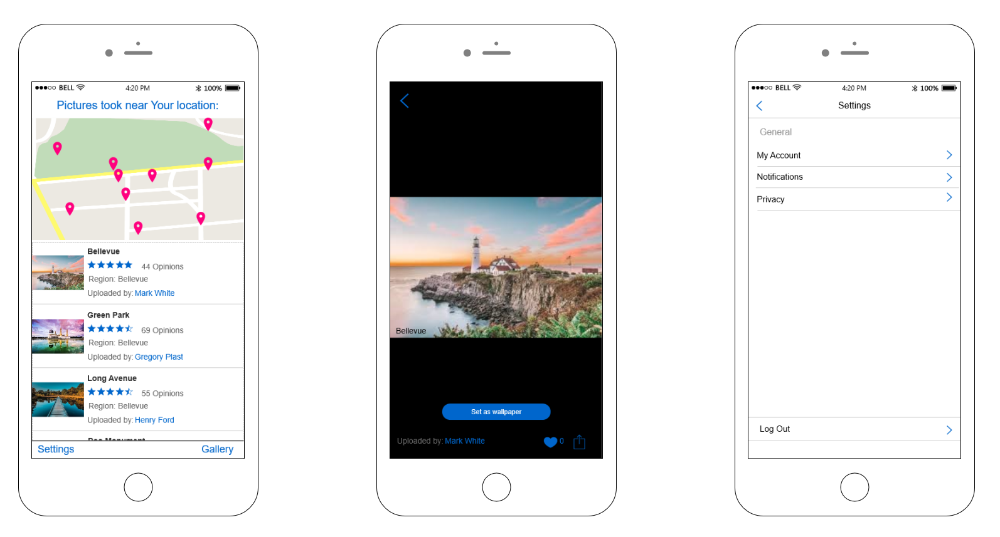

## BAI

BAI is an application that suggests You which Google photo to choose for a wallpaper depending on Your location at the moment.






```markdown
Syntax highlighted code block
# Header 1
## Header 2
### Header 3

- Bulleted
- List

1. Numbered
2. List

**Bold** and _Italic_ and `Code` text

[Link](url) and 
```

For more details see [GitHub Flavored Markdown](https://guides.github.com/features/mastering-markdown/).

### Jekyll Themes

Your Pages site will use the layout and styles from the Jekyll theme you have selected in your [repository settings](https://github.com/programming-liftoff/hello-world/settings). The name of this theme is saved in the Jekyll `_config.yml` configuration file.
### Go to:

<a href="https://trello.com/baiprojekt1"></a>&nbsp;
<a href="https://github.com/jgrochal/bai-project/tree/master/prototype"></a>&nbsp;
<a href="https://github.com/jgrochal/bai-project"></a>

### Created by

Joanna Grochal<br/>
Gabriela Łupak<br/>
Piotr Korzeń<br/>
Kamil Luśnia
