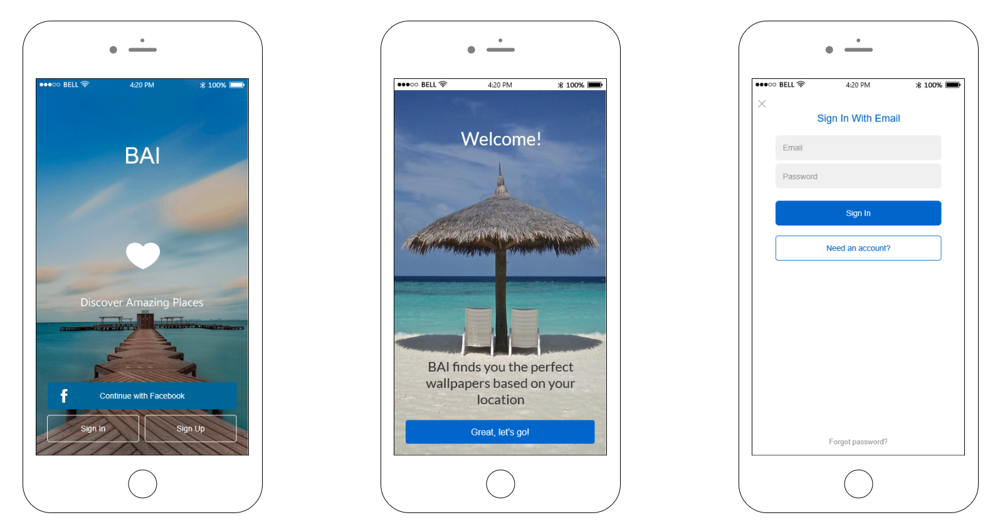

## BAI

BAI is an application that suggests You which Google photo to choose for a wallpaper depending on Your location at the moment.

The purpose of the application is to help users save photos from where they are at the moment, the pictures are saved in the database, you can always return to them

Application is implemented using technologies and frameworks as:
Cordova
PhoneGap
Bootstrap
jQueryMobile
Firebase

### Go to:

&nbsp;
&nbsp;

### Created by

Joanna Grochal 
Gabriela Łupak 
Piotr Korzeń 
Kamil Luśnia
